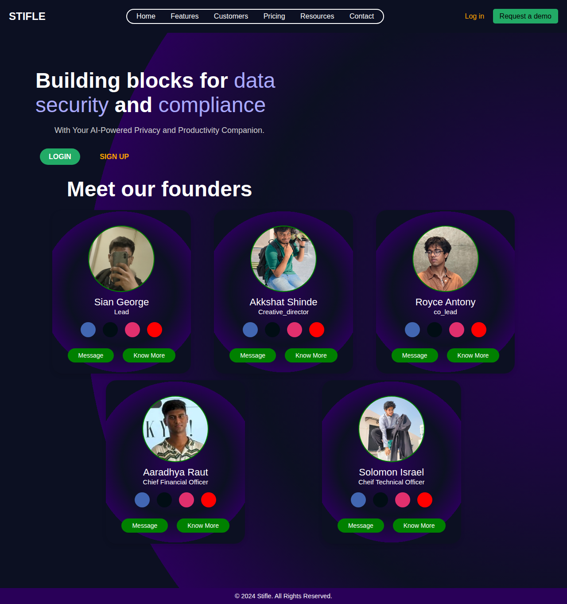

# Stifle - AI-Powered Privacy and Productivity Companion

**Building blocks for data security and compliance with your AI-Powered Privacy and Productivity Companion.**

[](https://sgcpu.github.io/Stifle_app/)
[](#license)
[](#team)

## 📋 Table of Contents

- [About](#about)
- [Features](#features)
- [Screenshots](#screenshots)
- [Getting Started](#getting-started)
- [Usage](#usage)
- [Project Structure](#project-structure)
- [Technologies Used](#technologies-used)
- [Team](#team)
- [Contributing](#contributing)
- [License](#license)

## 🎯 About

Stifle is a comprehensive web application designed to enhance productivity and ensure privacy in digital workspaces. Our AI-powered tools help users manage their digital life more effectively while maintaining data security and compliance standards.

Whether you're dealing with hyperactive mind challenges, managing bills, or need privacy during professional meetings, Stifle provides intelligent solutions to streamline your digital experience.

## ✨ Features

### 🧠 ControAlgo
**Master Your Mind with Focus Enhancement**
- Helps users concentrate on single tasks without multitasking burden
- Interactive focus timer with task logging
- Specifically designed for hyperactive minds
- Goal-oriented productivity tracking

### 💳 Smart Bill Management
**Never Miss a Payment Again**
- AI-powered bill reminders and notifications
- Robust management system for all your bills
- Automated tracking and organization
- Payment deadline alerts

### 🔒 Private Messaging Layer
**Secure Communication**
- Create secure messaging channels between users
- End-to-end privacy protection
- Professional communication tools
- Data security compliance

### 👻 Ghost Mode
**Professional Screen Sharing Privacy**
- Filter unnecessary notifications during meetings
- Maintain professional appearance while screen sharing
- AI-powered notification management
- Focus-friendly environment for presentations

### 🤖 AI Meeting Assistant
**Intelligent Note-Taking**
- Automatic meeting transcription and note-taking
- "Keep up without showing up" functionality
- Smart summarization of key points
- Integration with productivity workflows

## 📸 Screenshots

### Home Page


### Features Overview


### ControAlgo in Action


## 🚀 Getting Started

### Prerequisites

- Modern web browser (Chrome, Firefox, Safari, Edge)
- Local web server (optional, for development)

### Installation

1. **Clone the repository**
   ```bash
   git clone https://github.com/SGcpu/Stifle_app.git
   cd Stifle_app
   ```

2. **Run locally**
   
   **Option A: Direct file access**
   - Open `index.html` in your web browser
   
   **Option B: Local server (recommended)**
   ```bash
   # Using Python
   python3 -m http.server 8000
   
   # Using Node.js
   npx http-server
   
   # Using PHP
   php -S localhost:8000
   ```
   
   Then navigate to `http://localhost:8000` in your browser.

### Quick Start

1. Open the application in your browser
2. Navigate through the main sections:
   - **Home**: Overview and team information
   - **Features**: Explore all available tools
   - **Pricing**: Check subscription plans
3. Try individual features:
   - Click "Try Now" on any feature card
   - Test the ControAlgo focus timer
   - Explore Ghost Mode settings

## 💻 Usage

### ControAlgo Focus Tool
1. Navigate to the ControAlgo page
2. Enter your task in the input field
3. Click "Start Focus Mode" to begin timing
4. Work on your task without distractions
5. End focus mode when complete
6. Review your task log for productivity insights

### Bill Management
1. Access the Bill Management section
2. Add your bills and payment dates
3. Set up reminder preferences
4. Monitor upcoming payments
5. Track payment history

### Ghost Mode
1. Activate Ghost Mode before meetings
2. Configure notification filters
3. Share your screen professionally
4. Deactivate when meeting ends

## 📁 Project Structure

```
Stifle_app/
├── index.html              # Main landing page
├── Features.html           # Features overview page
├── Login page.html         # User authentication
├── premium.html            # Pricing plans
├── contrAlgo.html          # ControAlgo feature page
├── bill_mangement.html     # Bill management tool
├── ghost-mode.html         # Ghost mode settings
├── message_layer.html      # Private messaging
├── know_more.html          # Additional information
├── styles.css              # Main stylesheet
├── founder_style.css       # Team section styles
├── bill_management.css     # Bill management styles
├── contoAlgo.css          # ControAlgo styles
├── ghost_mode.css         # Ghost mode styles
├── premium.css            # Pricing page styles
├── login_style.css        # Authentication styles
├── script.js              # Main JavaScript
├── main.js                # Additional scripts
├── bill_management.js     # Bill management functionality
├── controAlgo.js          # ControAlgo functionality
├── ghost_mode.js          # Ghost mode functionality
├── meeting_ass.js         # Meeting assistant features
├── images/                # Image assets
│   ├── Stifle_logo.png
│   └── profile_img_*.jpeg
└── docs/                  # Documentation
    └── screenshots/       # Application screenshots
```

## 🛠 Technologies Used

- **Frontend**: HTML5, CSS3, JavaScript (ES6+)
- **Styling**: Custom CSS with responsive design
- **Icons**: Boxicons
- **Fonts**: Google Fonts (Orbitron, Roboto)
- **Deployment**: GitHub Pages ready
- **Version Control**: Git

## 👥 Team

Meet our talented development team from Fr. Conceicao Rodrigues College of Engineering:

### 🎯 **Sian George** - Lead
- **Role**: Project Lead & Main Developer
- **GitHub**: [@SGcpu](https://github.com/SGcpu)
- **LinkedIn**: [Sian George](https://www.linkedin.com/in/sian-george-864a69352/)

### 🎨 **Akkshat Shinde** - Creative Director
- **Role**: UI/UX Design & Frontend Development
- **GitHub**: [@Akkshat2oo6](https://github.com/Akkshat2oo6)
- **LinkedIn**: [Akkshat Shinde](https://www.linkedin.com/in/akkshat-shinde-825490246/)

### 🤝 **Royce Antony** - Co-Lead
- **Role**: Co-Lead Developer & Quality Assurance
- **GitHub**: [@RoyceAntony9](https://github.com/RoyceAntony9)
- **LinkedIn**: [Royce Antony](https://www.linkedin.com/in/aaradhya-r-77a95b32a/)

### 💼 **Aaradhya Raut** - Chief Financial Officer
- **Role**: Business Strategy & Financial Planning
- **Social**: [Instagram](https://www.instagram.com/aara.raut?igsh=MXF0b3doNDhqMG01Mw==)

### ⚡ **Solomon Israel** - Chief Technical Officer
- **Role**: Technical Architecture & Backend Integration
- **GitHub**: [@solomonZero9-dev](https://github.com/solomonZero9-dev)
- **LinkedIn**: [Solomon Sunkavalli](https://www.linkedin.com/in/solomon-sunkavalli-ba4a36333)

## 🤝 Contributing

We welcome contributions from the community! Here's how you can help:

### Getting Started
1. Fork the repository
2. Create a feature branch (`git checkout -b feature/AmazingFeature`)
3. Make your changes
4. Commit your changes (`git commit -m 'Add some AmazingFeature'`)
5. Push to the branch (`git push origin feature/AmazingFeature`)
6. Open a Pull Request

### Contribution Guidelines
- Follow existing code style and structure
- Test your changes thoroughly
- Update documentation as needed
- Ensure responsive design compatibility
- Add comments for complex functionality

### Areas for Contribution
- 🐛 Bug fixes and improvements
- 🆕 New feature development
- 📱 Mobile responsiveness enhancements
- 🎨 UI/UX improvements
- 📝 Documentation updates
- 🧪 Testing and quality assurance

## 📄 License

This project is licensed under the MIT License - see the [LICENSE](LICENSE) file for details.

## 📞 Contact & Support

- **Project Repository**: [https://github.com/SGcpu/Stifle_app](https://github.com/SGcpu/Stifle_app)
- **Institution**: [Fr. Conceicao Rodrigues College of Engineering](https://frcrce.ac.in/)
- **Issues**: [GitHub Issues](https://github.com/SGcpu/Stifle_app/issues)

---

<div align="center">

**Made with ❤️ by the Stifle Team**

[🏠 Home](https://sgcpu.github.io/Stifle_app/) • [✨ Features](#features) • [👥 Team](#team) • [🤝 Contributing](#contributing)

</div>